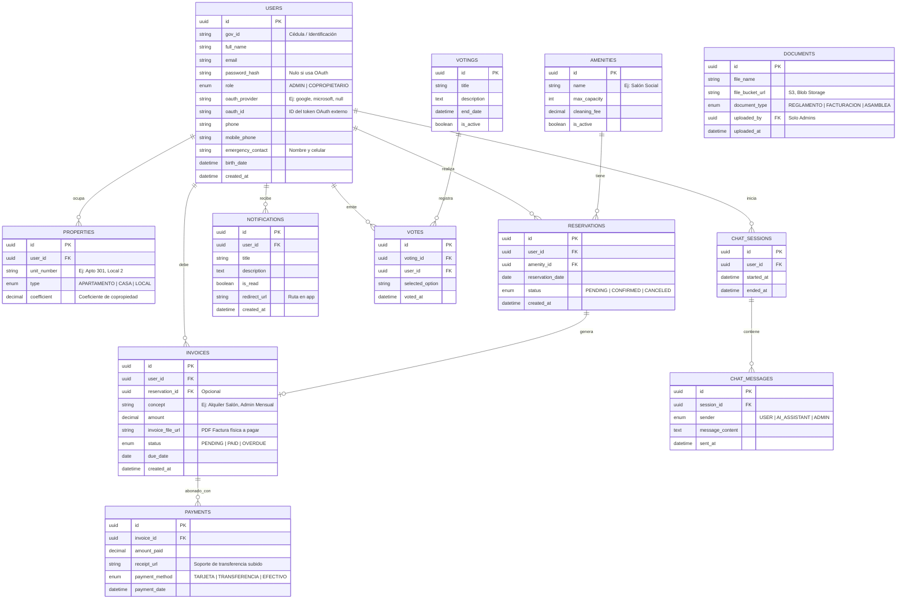

# Diseño de Base de Datos Arquitectura Híbrida (Relacional + NoSQL)

Este documento define la estructura de bases de datos para todas las funcionalidades del sistema "Propiedad Transparente". Utiliza un modelo de persistencia políglota: **Base de datos Relacional (SQL)** para integridad transaccional e identidad, y una **Base de datos NoSQL** para alto volumen de registros de auditoría y trazas (Logs).

## 1. Diseño Relacional (SQL)
Ideado para el Core Transaccional. Soporta inicio de sesión mediante credenciales clásicas y OAuth (Google/Microsoft), separa claramente los dos roles y almacena comprobantes documentales incluso para facturación.



---

## 2. Modelado de Logs y Auditoría No Relacional (NoSQL)
Para garantizar el rendimiento de la Base de Datos transaccional y la capacidad de absorber miles de eventos por segundo que rastrean cada paso que dan el Administrador y el Copropietario de forma independiente, implementaremos una colección NoSQL (ej. en **MongoDB** o **AWS DynamoDB**).

### Colección: `system_audit_logs`

Este bloque almacena documentos libres (JSON) registrando el 100% de los movimientos para posibles auditorías de seguridad, trazabilidad de fallos o informes gerenciales.

**Estructura de Documento Json:**
```json
{
  "_id": "ObjectId('64ae9f02b3c...)",
  "timestamp": "2026-04-18T18:15:30Z",
  "actor": {
    "user_id": "uuid-referencia-base-sql",
    "role": "ADMIN", 
    "full_name": "Ingrid Alvarado"
  },
  "action": {
    "module": "CARGUE_ARCHIVOS",
    "operation_type": "UPLOAD",
    "target_entity": "DOCUMENTS",
    "target_record_id": "uuid-document-134"
  },
  "details": {
    "file_name": "factura_servicios_abril.pdf",
    "impact_areas": ["INVOICES", "DASHBOARD"],
    "ip_address": "190.24.55.12",
    "user_agent": "Mozilla/5.0 (Windows NT 10.0; Win64;...) Chrome/122"
  },
  "status": "SUCCESS"
}
```

### Casos de uso de generación de LOGS (Ejemplos):
- **Oauth Login:** Se registrará un log tipo `AUTH` detallando proveedor (Google/MS) y si la IP del copropietario es inusual.
- **Cambio de Estados:** Si el Admin marca una factura como "PENDIENTE" a "PAGA", saltará un log registrando el cambio `{"old_status": "PENDIENTE", "new_status": "PAID"}`.
- **Reservas de Calendario:** Si el copropietario selecciona un día en Zonas Comunes, el evento registra el mes, año y área elegida.
